# KGDirectAU Training Pipeline

This document explains how a training run flows through the repository: which components exist, what each one does, and how they connect.

---

## 1. End-to-end lifecycle

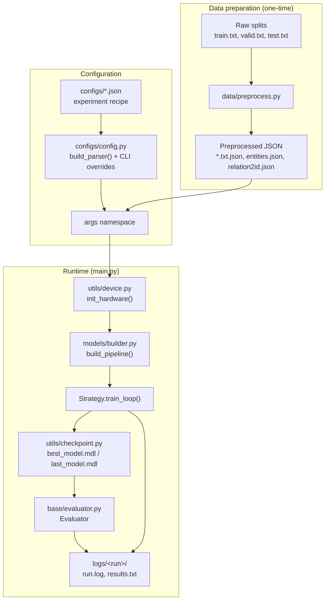

**Entry point:** `main.py` loads `args` from JSON + CLI, initializes GPU/seed, calls `build_pipeline()`, runs `trainer.train_loop()`, then loads the best checkpoint into `Evaluator` for test metrics.

---

## 2. The five composable pillars

Every experiment is assembled in `build_pipeline()` from five swappable pieces. The JSON config points to each one via path fields.

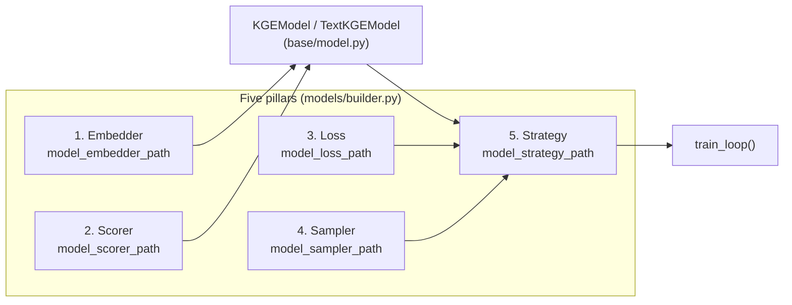

| Pillar | Config key | Role | Typical location |
|--------|------------|------|------------------|
| **Embedder** | `model_embedder_path` | Maps entity/relation IDs (or text tokens) to vectors | `models/embedders/lookup_embedder.py`, `text_embedder.py` |
| **Scorer** | `model_scorer_path` | Pure scoring math on embeddings (DistMult, ComplEx, RotatE, …) | `models/scorers/*_scorer.py` |
| **Loss** | `model_loss_path` | Objective: BCE, CE, AU alignment/uniformity, InfoNCE, … | `models/losses/*_loss.py` |
| **Sampler** | `model_sampler_path` | Generates corrupted triples for negative sampling (optional) | `models/samplers/*_sampler.py` |
| **Strategy** | `model_strategy_path` | Owns the training loop: batches, forward, backward, validation | `models/strategies/*_strategy.py` |

The strategy is the **orchestrator**. It receives the bound model, loss, and (when needed) sampler, then implements `train_loop()`, `train_batch()`, and validation hooks.

---

## 3. Model assembly

Embedders and scorer are **bound** into a single `nn.Module` before the strategy runs.

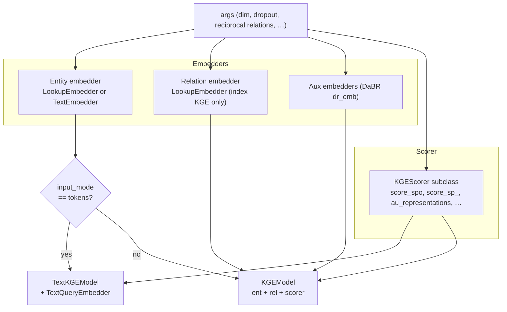

**Responsibility split**

- **Embedder:** index lookup or text encoding → `[batch, dim]` vectors.
- **Scorer:** tensor math only (no embedding tables). Implements 1-to-1 scoring, 1-vs-all broadcasting, candidate scoring, and (for AU models) representation extraction for KGAU.
- **KGEModel:** wires embedders to scorer, handles reciprocal relations, optional L2 normalization for LP/AU, and delegates `score_sp_` / `predict_tail_sp_` to the scorer.

---

## 4. Data layer

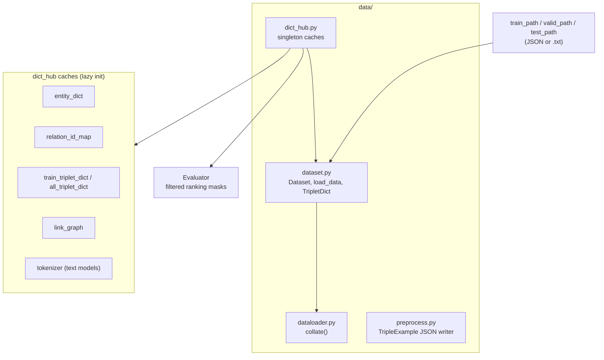

**Roles**

- **`preprocess.py`:** converts raw TSV triples + entity metadata into enriched JSON (`TripleExample`: ids, text, descriptions).
- **`Dataset`:** reads JSON lines for training/eval batches.
- **`dict_hub`:** global caches used for filtered link prediction (all known true triples) and entity indexing.
- **`collate`:** batches examples into tensors or token dicts depending on model type.

---

## 5. Training paradigms (strategies)

`build_pipeline()` infers a **paradigm** from the strategy path and wires loss/sampler accordingly.

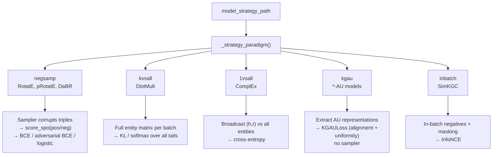

| Model family | Strategy | Sampler | Loss | Negative signal |
|--------------|----------|---------|------|-----------------|
| DistMult | `kvsall_strategy` | none | `kl_loss` | all entities (K vs all) |
| ComplEx | `1vsall_strategy` | none | `ce_loss` | all entities (1 vs all) |
| RotatE / pRotatE | `negsamp_strategy` | `filtered_1_to_n_sampler` | `bce_loss` / `adversarial_bce_loss` | sampled negatives |
| DaBR | `negsamp_strategy` | `uniform_pointwise_sampler` | `pointwise_logistic_loss` | pointwise negatives |
| SimKGC | `inbatch_strategy` | `masking_sampler` | `infonce_loss` | in-batch + mask |
| *-AU (KGAU) | `kgau_strategy` | none | `au_loss` | positive batch geometry only |

---

## 6. Inner training loop (index KGE strategies)

Most lookup-table strategies share helpers in `models/builder.py`: `run_index_kge_train_loop()` or `run_step_based_kge_train_loop()`.

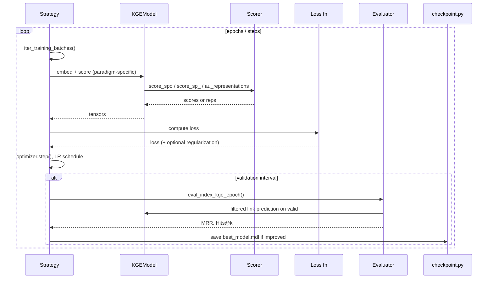

**Shared training utilities (`models/builder.py`)**

- `build_optimizer`, `build_lr_scheduler`, `apply_kge_regularization`
- `init_index_kge_trainer` — attaches `Evaluator`, entity dict, memory tracker
- Early stopping / step cadence via `utils/training_cadence.py`

**KGAU strategy (`kgau_strategy.py`)** uses its own loop but the same validation/checkpoint pattern: builds `KGAULoss`, optional learnable gammas/`tuni`, gamma linear schedule, and calls `model` AU representation hooks on the scorer.

---

## 7. Single training batch (conceptual)

How components interact for one batch depends on the paradigm:

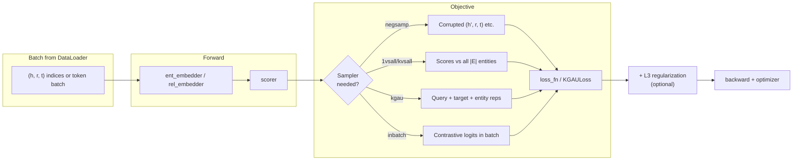

---

## 8. Evaluation pipeline (post-training)

After `train_loop()` returns, `main.py` does **not** use the trainer for testing—it reloads weights into a fresh `Evaluator`.

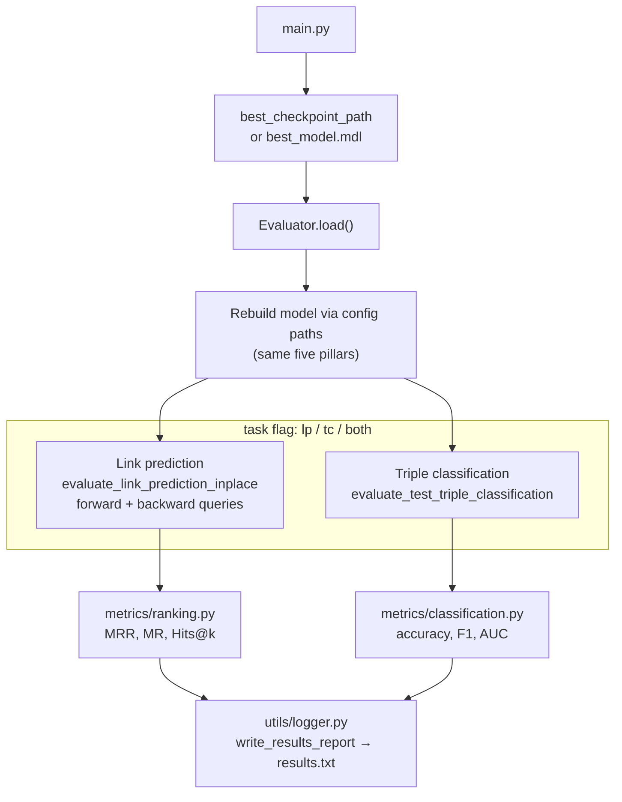

**Filtered ranking:** `Evaluator` uses `all_triplet_dict` from `dict_hub` to mask known true tails/heads so ranks reflect *filtered* link prediction.

---

## 9. Configuration → component map (example)

`ComplEx-AU` on WN18RR (`configs/ComplEx-AU_WN18RR_learnable_gammas_tuni.json`):

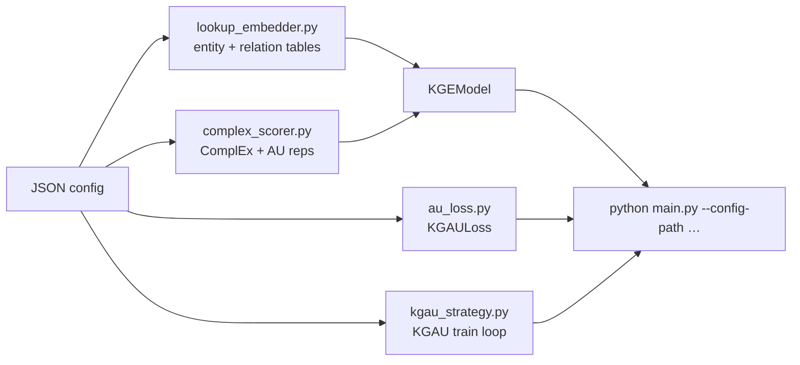

Equivalent CLI overrides (any registered key): `--batch-size`, `--lr`, `--epoch-per-eval`, etc. See `configs/config.py` → `build_parser()`.

---

## 10. Outputs and HPO

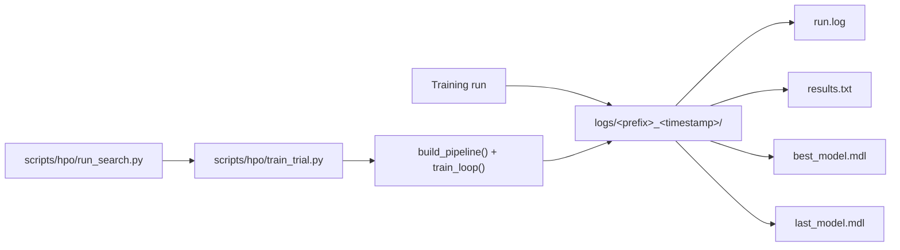

HPO trials are thin wrappers: they load a trial JSON config, call the same `build_pipeline()` path as `main.py`, and report `best_mrr` as the objective.

---

## 11. Component dependency graph (summary)

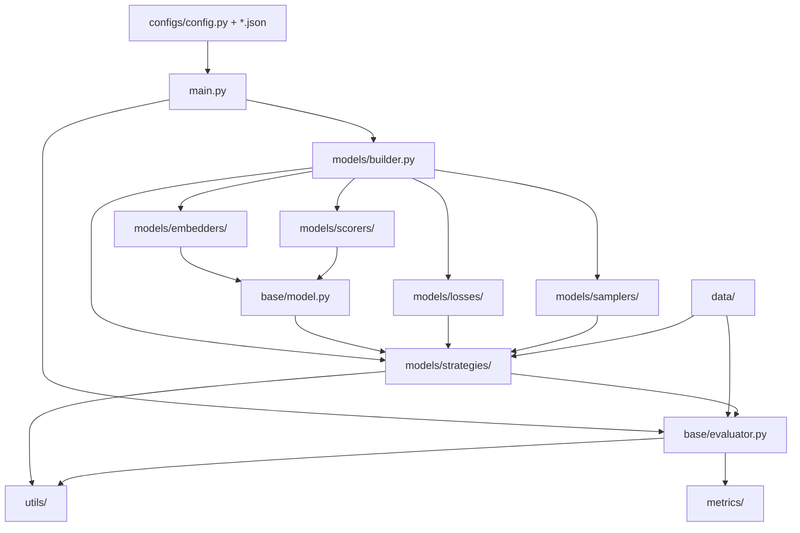

---

## Quick reference: who owns what?

| Concern | Owner |
|---------|--------|
| Hyperparameters & paths | `configs/*.json` + `configs/config.py` |
| GPU / DDP / parameter counts | `utils/device.py` |
| Experiment wiring | `models/builder.py` → `build_pipeline()` |
| Embedding tables / text encoding | `models/embedders/` |
| Score functions & AU representations | `models/scorers/` |
| Training objective | `models/losses/` |
| Negative corruption | `models/samplers/` (when used) |
| Epoch/step loop, optim, validation | `models/strategies/` |
| Model binding & 1-vs-all API | `base/model.py` (`KGEModel`, `TextKGEModel`) |
| Test metrics | `base/evaluator.py` + `metrics/` |
| Checkpoint I/O | `utils/checkpoint.py` |
| Logging & result files | `utils/logger.py` |
